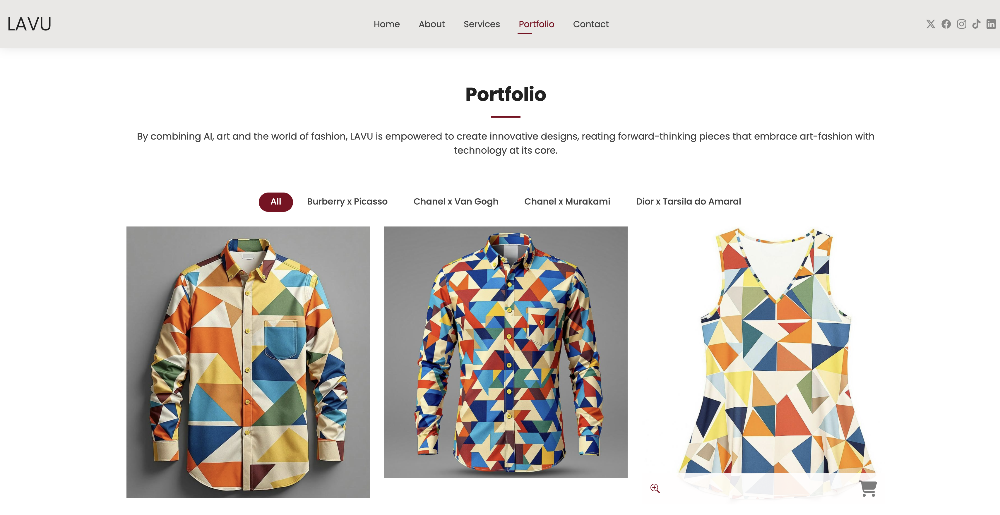

# LAVU : Where your dreams of personalized luxury come true!

## Introduction

LAVU is based on the concept of combining traditional products with trends consumed by this generation. One of the main allies in applying uniqueness is the use of technology, especially generative Artificial Intelligence, which is being used to enable the creation of limited edition products for the luxury industry with art.

## Production and outputs

### Project 1( Burberry T-hirts and Maisons a Horta)

LAVU’s first project aims to combine Burberry t-shirts with Picasso’s famous painting Maisons a Horta, since t-shirts are a primary item chosen by many people on a daily basis.

### Project 2(Chanel Bag and Starry Night Over the Rhone)
We decided to use Chanel handbags for our second customisation project
implementing collected information. Chanel, one of the most recognisable and well known
luxury fashion brands in the world, is very popular among current generations for its classic
product designs and craftsmanship.

### Project 3 (Chanel Perfumes and Takashi Murakami)

For the third product assignment at LAVU, we discovered that
Chanel’s fragrance and cosmetics division alone brought in USD 6.5 billion in revenue in
FY24 according to Forbes. Therefore we have decided to design Chanel perfume bottles which
carry a distinctive design principle, in order to give customers their favorite perfume bottles
redesign with fun and lovable art style.

### Project 4 (Dior and Tarsila do Amaral)

LAVU’s fourth product explores Dior’s skincare lines and Tarsila do Amaral’s painting, titled
“Postcard.”We strongly support a multi-plural environment to pursue big
dreams, and considering that our exploration was defined with Tarsila do Amaral, a Brazilian
painter and Latin American modernist.

## Portfolio

### Webiste

Our website hosted on: https://lavu-ai.neocities.org/, has 5 main pages: Home, About, Services, Portfolio
and Contact. The Home page instigates the user about the purpose of LAVU, About explains
the values and history of LAVU, the Portfolio demonstrates all the product cases where the
user can be redirected to the purchase page, and the Contact, where it is possible to contact
LAVU directly by email.

### Payment and sales

We created a flow where the user views a product from our portfolio and can choose
to buy it, and our payment sales is implemented through PayPal.Each product has a link
that takes the user to another page where they confirm their information, such as name,
email, and desired quantity. After that, the user is redirected to the payment page using
the PayPal button as observed in Fugure 6. We receive the information that the products
were purchased through an internal Getform and, after the payment is made, we send
the image to the user by email. We decided not to carry out an automatic process of
offering the image for download, as we have the possibility of better tracking our product
and improving the quality of delivery of the image to the customer.

### NFTs

For  LAVU’s digital integration strategy we have published our art work in the web3
ecosystem by creating and listing our art work as NFT or Non Fungible Tokens to estblish
LAVU’s digital ownership for the exclusive art design. It will also allow our customer or
collector to invest in our custom design. Most of our art work was listed on NFT marketplace
like OpenSea and Rarible.

### Social Media Presence

LAVU’s social media presence is based on exploring different social groups. To this end,
we are present on Instagram to increase our brand awareness and launch new products; on
Facebook, to target specific audiences based on demographics, interests and behaviors; on
Twitter, which highlights our brand voice; on TikTok, which allows us to interact with the
public in a fun and informal way; and on LinkedIn, which is highly effective in generating
quality leads.

## Business Model Canvas

# Students members 

* Lorrayne Reis Silva
* Abhishek Das

## Responsible teacher

* Professor Eduardo Alonso

